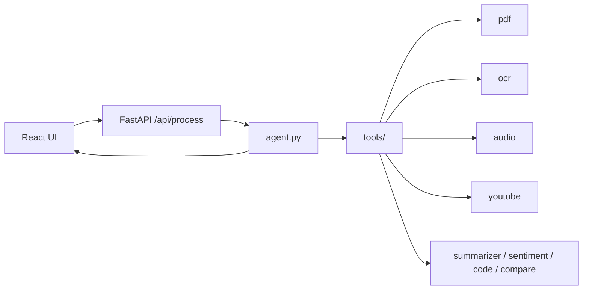

# ParallelMinds

Multi-modal agent for the DSAI Assignment (June 2026). Accepts text, images, PDFs, and audio in one request, classifies intent, chains tools autonomously, and returns text-only answers with plan traces.

## Architecture




## Setup

```bash
cd ParallelMinds
python -m venv .venv
source .venv/bin/activate
pip install -r backend/requirements.txt

cp backend/.env.example backend/.env
# set GROQ_API_KEY in backend/.env

# backend
cd backend && uvicorn main:app --reload --port 8000

# frontend (new terminal)
cd frontend && npm install && npm run dev
```

- Backend: http://localhost:8000/health
- Frontend: http://localhost:5173

## Environment variables

| Variable | Required | Description |
|----------|----------|-------------|
| `GROQ_API_KEY` | Yes | Groq API key |
| `GROQ_MODEL` | No | Text model, default `llama-3.3-70b-versatile` |
| `GROQ_VISION_MODEL` | No | Vision/OCR model, default `meta-llama/llama-4-scout-17b-16e-instruct` |
| `GROQ_WHISPER_MODEL` | No | Audio model, default `whisper-large-v3` |
| `CORS_ORIGINS` | No | Comma-separated frontend URLs |
| `MAX_FILE_MB` | No | Upload file size limit in MB (default 25) |
| `MAX_AUDIO_MB` | No | Audio upload size limit in MB (default 25) |
| `MAX_AUDIO_SEC` | No | Audio duration limit in seconds (default 600) |
| `MAX_CTX_TOKENS` | No | Context cap before truncation (default 12000) |
| `MAX_HISTORY` | No | Chat memory turns per session (default 8) |
| `YT_PROXY_LIST` | No | Comma/newline separated proxy URLs for rotating YouTube transcript fetch |


## Tests

```bash
pytest
```

Covers all 5 assignment test cases (mocked Gemini/transcripts for reliability).

## Design decisions

- **Groq for LLM/OCR/audio** — because it has generous free tier 
- **Flat tools/** — seprate files for every task
- **Clarification first** — agent never guess asks follow up if intent is not clear 
- **YouTube chain** — find url -> fetches the transcript -> summarizes
