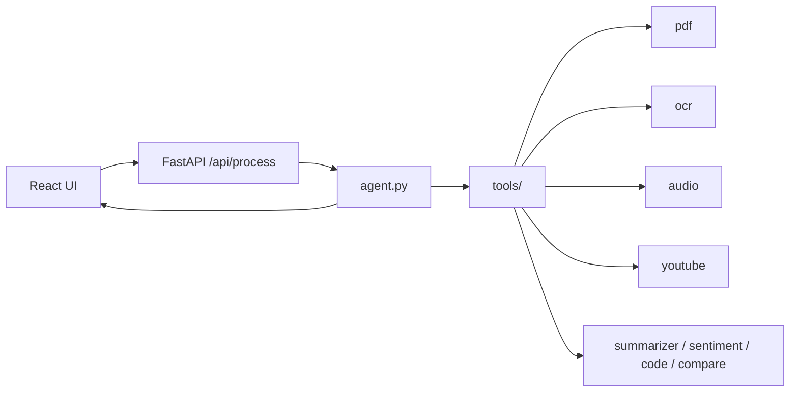

# ParallelMinds

Multi-modal agent for the DSAI Assignment (June 2026). Accepts text, images, PDFs, and audio in one request, classifies intent, chains tools autonomously, and returns text-only answers with plan traces.

## Architecture



## Structure

```
ParallelMinds/
├── backend/
│   ├── main.py          # FastAPI + /api/process
│   ├── agent.py         # intent + tool routing
│   └── tools/           # pdf, ocr, audio, youtube, compare, code, sentiment, summarizer
├── frontend/            # React + Vite
├── tests/               # assignment test cases 1–5
├── Dockerfile
└── render.yaml
```

## Setup

```bash
cd ParallelMinds
python -m venv .venv
source .venv/bin/activate
pip install -r backend/requirements.txt

cp backend/.env.example backend/.env
# set GROQ_API_KEY in backend/.env

# backend
cd backend && uvicorn main:app --reload --port 8000

# frontend (new terminal)
cd frontend && npm install && npm run dev
```

- Backend: http://localhost:8000/health
- Frontend: http://localhost:5173

## Environment variables

| Variable | Required | Description |
|----------|----------|-------------|
| `GROQ_API_KEY` | Yes | Groq API key |
| `GROQ_MODEL` | No | Text model, default `llama-3.3-70b-versatile` |
| `GROQ_VISION_MODEL` | No | OCR model, default `llama-3.2-11b-vision-preview` |
| `GROQ_WHISPER_MODEL` | No | Audio model, default `whisper-large-v3` |
| `CORS_ORIGINS` | No | Comma-separated frontend URLs |

## API

`POST /api/process` — multipart form: `query` + `files[]`

Returns: `answer`, `intent`, `plan`, `extracted`, `need_clr`, `question`

## Tests

```bash
pytest
```

Covers all 5 assignment test cases (mocked Gemini/transcripts for reliability).

## Design decisions

- **Groq for LLM/OCR/audio** — generous free tier; PDF/YouTube stay local
- **Flat tools/** — one file per task, no registry pattern
- **Clarification first** — agent asks when intent is vague, never guesses
- **YouTube chain** — find URL → fetch transcript → summarize in one autonomous run

## Deploy

```bash
docker build -t parallelminds .
docker run -p 8000:8000 -e GROQ_API_KEY=... -e CORS_ORIGINS=... parallelminds
```

Or push to GitHub and deploy via `render.yaml`.
