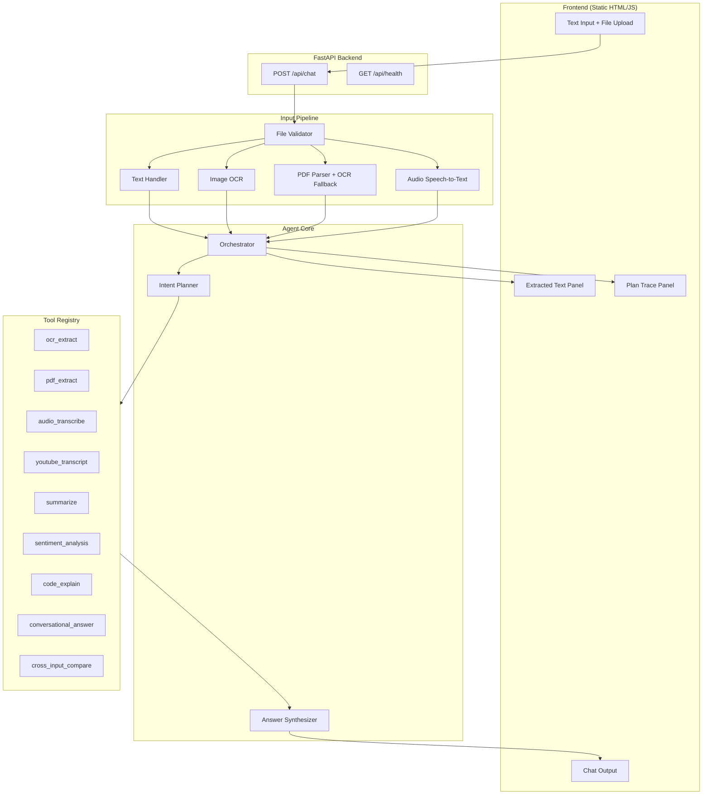

# Architecture — ParallelMinds Agent

## Overview

ParallelMinds is a multi-modal agentic application that accepts text, images, PDFs, and audio in a single request, understands user intent, and autonomously chains tools to produce text-only outputs.

## Component Diagram



## Data Flow

1. **Ingest** — User submits query + files via `/api/chat`
2. **Extract** — Pipeline extracts/transcribes all inputs into `ExtractedContent` objects
3. **Plan** — Planner detects intent; asks clarification if ambiguous
4. **Execute** — Orchestrator runs minimal tool chain from registry
5. **Respond** — Synthesizer produces final text answer + plan trace for UI

## Directory Structure

```
app/
├── main.py              # FastAPI entry
├── config.py            # Settings
├── api/routes/          # HTTP endpoints
├── agent/               # Planner + orchestrator
├── ingest/              # Multi-input extraction
├── tools/               # Tool implementations
├── models/              # Pydantic schemas
└── static/              # Chat UI
tests/                   # pytest suite
docs/                    # Architecture & design
```

## Assignment Task Mapping

| Assignment Task | Tool / Module |
|-----------------|---------------|
| Image/PDF OCR | `tools/ocr.py`, `tools/pdf_parser.py` |
| YouTube transcript | `tools/youtube.py` |
| Summarization | `tools/summarizer.py` |
| Sentiment | `tools/sentiment.py` |
| Code explanation | `tools/code_explainer.py` |
| Audio transcription | `tools/audio_transcribe.py` |
| Cross-input reasoning | `tools/cross_input.py` |
| Follow-up questions | `agent/planner.py` |
| Plan trace in UI | `static/js/app.js` + `models/schemas.py` |
